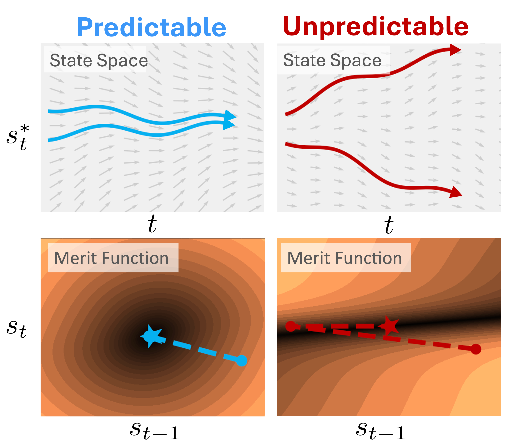

# Predictability Enables Parallelization of Nonlinear State Space Models


**Predictability Enables Parallelization of Nonlinear State Space Models**\
*Xavier Gonzalez\*, Leo Kozachkov\*, David M. Zoltowski, Kenneth L. Clarkson, Scott W. Linderman*\
Paper: https://www.alphaxiv.org/abs/2508.16817
Talk: https://www.youtube.com/watch?v=C9AqgW51-B4

This repository contains code for the paper "Predictability Enables Parallelization of Nonlinear State Space Models." This paper is published at NeurIPS 2025.

In this paper, we consider the problem of parallelizing nonlinear [state space models (SSMs)](https://probml.github.io/ssm-book/root.html) of the form $$s_t = f_t(s_{t-1})$$. Nonlinear SSMs include models like [recurrent neural networks (RNNs)](https://arxiv.org/abs/2407.19115) and [Markov chain Monte Carlo (MCMC)](https://arxiv.org/abs/2508.18413), which used to be considered to be "inherently sequential." However, parallel Newton methods like [DEER](https://arxiv.org/abs/2309.12252) and [DeepPCR](https://arxiv.org/abs/2309.16318) demonstrated that it is possible to [parallelize evaluation of a nonlinear SSM over the sequence length](https://github.com/lindermanlab/parallelizing_with_lds) by treating it as an iterative optimization problem. Importantly, though, such parallel evaluation is useful only if this optimization converges quickly in a small number of steps. 

In our paper, we link the "predictability" of nonlinear SSMs---as measured by their largest Lyapunov exponent (LLE)---to the conditioning of the optimization problem solved by parallel Newton methods. As our banner figure belows shows, we provide the following key conclusion:

**Predictable SSMs are parallelizable. Unpredictable SSMs are not.**



These results have important implications for the use of parallel Newton methods, and the design of nonlinear SSMs. Read our paper to learn more! 

## Main attractions

The experiments in this codebase exist primarily to support the theory developed in our paper.

However, we highlight some features of the codebase that could be useful broadly:

1. In `src/deer.py`, we provide a fairly lightweight instantiation of the DEER algorithm. This implementation uses the causal nature of DEER to get the number of steps to convergence for a large number of sequence lengths T in an efficient manner.
2. In `src/lle.py`, we provide many helper functions for estimating the largest Lyapunov exponent (LLE) of an SSM. This code will be useful to those who want to evaluate the predictability of their SSM.
3. In `src/examples` we provide an API for instantiating different SSMs so that they can all be evaluated easily with DEER. See the [README](https://github.com/lindermanlab/predictability_enables_parallelization/blob/main/src/examples/README.md) in that section.
4. In particular, in `src/examples/chaotic_flows.py`, we port part of the [dysts](https://github.com/GilpinLab/dysts) codebase into JAX.

## Installation

Info about how to install jax: https://docs.jax.dev/en/latest/installation.html

* Use python 3.12.1
* Use jax 0.5.3
* Use a virtual environment

### CPU

`pip install -U jax`

### GPU

`pip install -U jax[cuda12]`

### rest of the way

After installing `jax` appropriately based on hardware, simply run

`pip install -e .`

## Citation

Please star this repo if you find our code interesting or useful!

```
@inproceedings{gonzalez2025predictability,
  title={{Predictability Enables Parallelization of Nonlinear State Space Models}},
  author={Gonzalez, Xavier and Kozachkov, Leo and Zoltowski, David M. and Clarkson, Kenneth L. and Linderman, Scott W.},
  booktitle={Neural Information Processing Systems (NeurIPS)},
  year={2025},
}
```
